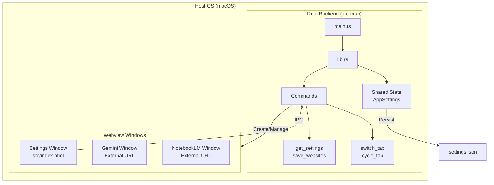

# 🚀 Peko

**Turn any webpage into a desktop app** - A lightweight Tauri v2 wrapper for macOS with multi-tab support.

## ✨ Features

- 🎐 **Lightweight** - ~5MB vs ~100MB for Electron apps
- 🚀 **Fast** - Built with Rust + Tauri v2, low memory usage
- 📑 **Multi-Tab** - Switch between up to 5 websites
- 💾 **Persistent Login** - Each site keeps you logged in
- ⚡ **Native Menu Bar** - macOS native tabs and settings
- 🌏 **International Input** - Full IME support for Chinese, Japanese, Korean input

### Keyboard Shortcuts

| Shortcut | Action |
|----------|--------|
| `⌘ 1-5` | Switch to tab 1-5 |
| `⌘ Tab` | Cycle to next tab |
| `⌘ [` | Navigate back |
| `⌘ ]` | Navigate forward |
| `⌘ '` | Toggle notes (sidebar → window → hidden) |
| `⌘ ,` | Open Settings |

## 🤔 Why Tauri?

| Aspect | **Tauri** | **Native Swift** | **Flutter** |
|--------|-----------|------------------|-------------|
| **App Size** | ~5 MB ✅ | ~10 MB | ~20 MB |
| **Performance** | Near-native | Native | Near-native |
| **Platforms** | macOS, Windows, Linux, iOS*, Android* | Apple only | All platforms |
| **UI Tech** | Web (HTML/CSS/JS) | SwiftUI/UIKit | Dart widgets |
| **Memory** | Low (Rust) | Low | Medium |

**Why we chose Tauri:**
- 🦀 **Rust backend** — memory-safe, fast, secure
- 🌐 **Web frontend** — reuse existing web skills
- 📦 **Tiny bundles** — uses system WebView, not bundled Chromium
- 🔒 **Security-first** — sandboxed permissions, CSP support
- 📱 **Mobile ready** — iOS/Android support in Tauri v2

> *Mobile support is in beta but rapidly maturing. Run `cargo tauri ios dev` or `cargo tauri android dev` to test.*

## 📦 Installation

### Download (Recommended)
Download the latest `.dmg` from [Releases](https://github.com/your-repo/peko/releases).

### Build from Source

**Prerequisites:**
- Rust ≥ 1.85 ([rustup.rs](https://rustup.rs))
- Node.js ≥ 22 ([nodejs.org](https://nodejs.org))
- pnpm ≥ 10 (`npm install -g pnpm`)
- Xcode CLI Tools (`xcode-select --install`)

```bash
# Clone and install
git clone https://github.com/your-repo/peko.git
cd peko
pnpm install

# Development mode
pnpm tauri dev

# Build for production (app + DMG)
pnpm tauri build
```

**Build outputs:**
| File | Location |
|------|----------|
| App | `src-tauri/target/release/bundle/macos/Peko.app` |
| DMG | `src-tauri/target/release/bundle/dmg/Peko_0.1.0_aarch64.dmg` |

To install, open the DMG and drag Peko to Applications.

### Manual DMG Creation

If you need to create a DMG manually from the `.app`:

```bash
# Create a temporary folder
mkdir -p dmg_temp
cp -r src-tauri/target/release/bundle/macos/Peko.app dmg_temp/

# Create the DMG
hdiutil create -volname "Peko" -srcfolder dmg_temp -ov -format UDZO Peko.dmg

# Cleanup
rm -rf dmg_temp
```

## 🔧 Configuration

### Default Websites
Peko comes pre-configured with:
1. ✨ **Gemini** - https://gemini.google.com/app
2. 📓 **NotebookLM** - https://notebooklm.google.com

### Adding Custom Websites
1. Press `⌘ ,` or go to **Peko → Settings**
2. Click **Add Website**
3. Enter name, URL, and choose an emoji
4. Click **Save & Close**

Settings are stored in `~/Library/Application Support/com.peko.app/settings.json`

## 📝 Notes Panel

A built-in notes panel for jotting down thoughts while browsing. Press `⌘'` (Cmd+backtick) to cycle through display modes.

### Display Modes

| Mode | Description |
|------|-------------|
| **Sidebar** | Attached to right of website window (no title bar) |
| **Window** | Standalone floating window (with title bar) |
| **Hidden** | Panel closed |

### Features

- **Markdown support** — Write in markdown, preview rendered output
- **Auto-save** — Notes save automatically as you type
- **Persistent** — Notes are stored across app restarts
- **Edit/Preview tabs** — Toggle between editing and viewing

### Implementation Notes

> **Current Approach**: Sidebar mode uses an adjacent window without decorations (no title bar) positioned next to the website window. This provides a sidebar-like appearance while using Tauri's stable API.

> **Limitation**: True embedded multi-webview (sidebar within the same window) requires Tauri's `unstable` feature, which is experimental. The current implementation approximates this with adjacent windows.

#### Alternative Implementations

| Approach | Pros | Cons |
|----------|------|------|
| **Adjacent windows** (current) | Works with stable API | Two separate windows |
| **Multi-webview** | True embedded sidebar | Requires `unstable` feature |
| **JavaScript injection** | Single window | Blocked by CSP on external sites |

## 📁 Project Structure

```
peko/
├── src/                  # Frontend (Settings UI)
│   ├── index.html        # Settings window
│   ├── styles.css        # Dark theme styling
│   └── main.js           # Settings logic
└── src-tauri/            # Backend (Rust)
    ├── Cargo.toml        # Rust dependencies
    ├── tauri.conf.json   # App configuration
    └── src/
        ├── main.rs       # Entry point
        └── lib.rs        # Menu, windows, commands
```

## 🏗️ Architecture

Peko uses a hybrid architecture combining a secure Rust backend with a lightweight web frontend.



### Core Components

1. **Rust Backend (`lib.rs`)**
   - **State Management**: Handles active tab tracking and website configuration using `Mutex<AppSettings>`.
   - **Window Manager**: Dynamically creates/destroys windows based on settings. Each website runs in its own isolated webview.
   - **IPC Commands**: Exposes functions like `save_websites` and `switch_tab` to the frontend context.
   - **Menu System**: Native macOS menu bar integration for tab switching and controls.

2. **Frontend (`src/`)**
   - **Settings UI**: A lightweight HTML/JS interface for managing websites.
   - **IPC Bridge**: Uses `window.__TAURI__.core.invoke` to communicate with Rust.
   - **Asset Handling**: Bundled minimal CSS/JS resources.

3. **Security Model**
   - **Capabilities**: Using `capabilities/default.json` to strictly define permissions.
   - **Isolation**: External websites (Google, etc.) are loaded in restricted webviews.
   - **Permissions**: `shell:allow-open` is restricted to specific URL schemes.

## 🛠️ Development

```bash
# Run with hot reload
pnpm tauri dev

# Check Rust code
cd src-tauri && cargo check

# Format code
cargo fmt
```

## 📋 License

MIT

---

**Inspired by** [Pake](https://github.com/tw93/Pake) and [Tauri](https://tauri.app)
